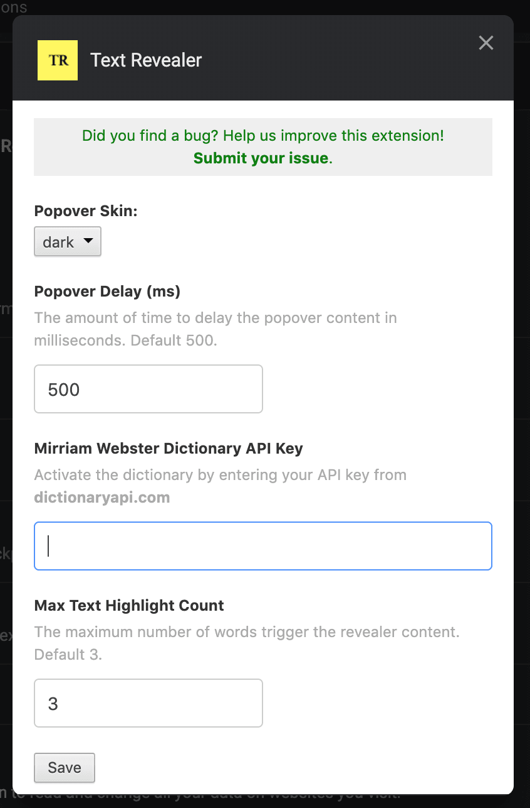

Reveal deeper information about highlighted text on a web page. When text is selected, a popover displays useful details about the text such as:

- Wikipedia entries
- Dictionary definition
- ...and more to come.

### Preview

### Loading In Chrome

1. [Download this repository](https://github.com/jamigibbs/text-revealer-chrome-extension/archive/master.zip).
2. Navigate to the Chrome menu > More Tools > Extensions
3. Select "Load unpacked"
4. Select the downloaded folder unzipped.

### Available Settings

